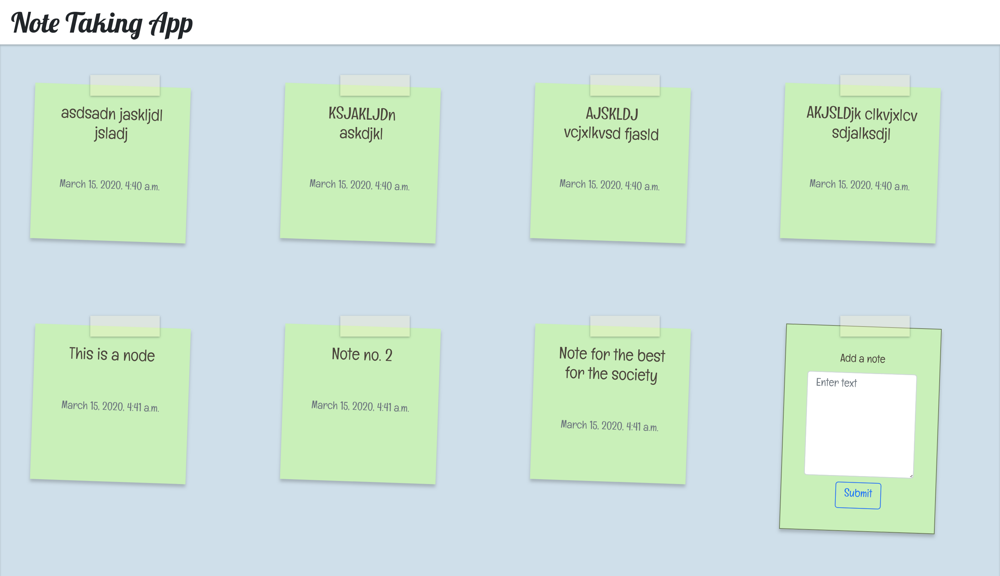

# Note Taking App

Purpose - This project is created to demonstrate usage of django.
It is app to create notes and show notes like the sticky notes in Windows.

Current Status - Completed 

Hosted at - https://ayushkm.pythonanywhere.com
 

# Instructions to install  
Run these commands in terminal :-
1. git clone https://github.com/kmAyush/Note-Taking-App
2. cd Note-Taking-App/NotesProject
3. pip3 install django-widget-tweaks
4. py manage.py makemigrations
5. py manage.py migrate
6. py manage.py runserver
7. Run 127.0.0.1:8000 on Web browser

# Features
1. Multiple browser support.
2. Data is managed in django inbuilt database mysql.
3. Easy to create sticky notes.
